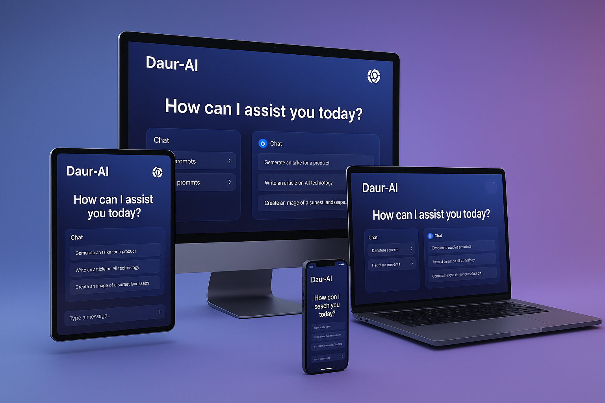

# Daur-AI v2.0 Installation Guide



This guide provides detailed instructions for installing and configuring Daur-AI v2.0 on your system. Please follow the steps carefully to ensure a successful setup.

## 1. Prerequisites

Before you begin, make sure you have the following software installed on your system:

- **Python 3.8+**: [Download Python](https://www.python.org/downloads/)
- **Node.js 16+**: [Download Node.js](https://nodejs.org/)
- **Git**: [Download Git](https://git-scm.com/downloads/)
- **Ollama (Recommended for local LLM)**: [Download Ollama](https://ollama.ai/)

## 2. Installation

You can install Daur-AI v2.0 using the automatic installation script, which simplifies the process of setting up the environment and dependencies.

### Automatic Installation

1.  **Clone the repository:**

    ```bash
    git clone https://github.com/daurfinance/Daur-AI-v1.git
    cd Daur-AI-v1
    ```

2.  **Run the installation script:**

    This script will:
    - Create a Python virtual environment.
    - Install all required Python packages.
    - Install all required Node.js packages.

    ```bash
    ./install.sh
    ```

## 3. Configuration

After the installation is complete, you need to configure the application. The main configuration file is `telegram_config.json`.

### Telegram Bot Configuration

To use the Telegram bot for remote control, you need to create a new bot and get a token from the [@BotFather](https://t.me/BotFather) on Telegram.

1.  **Create a new bot:**
    - Open Telegram and search for `@BotFather`.
    - Send `/newbot` and follow the instructions.
    - Copy the generated bot token.

2.  **Update the configuration file:**
    - Open `telegram_config.json` in a text editor:
      ```bash
      nano telegram_config.json
      ```
    - Replace `"YOUR_BOT_TOKEN"` with your actual bot token.
    - Add your Telegram user ID to the `allowed_users` list to restrict access to the bot.

    ```json
    {
        "telegram": {
            "bot_token": "YOUR_BOT_TOKEN",
            "allowed_users": [123456789],
            "features": {
                "voice_recognition": true,
                "file_processing": true,
                "image_analysis": true
            }
        },
        ...
    }
    ```

### AI Model Configuration

Daur-AI supports both local models via Ollama and cloud models like OpenAI. You can configure the default model in `telegram_config.json`.

```json
{
    ...
    "ai_agent": {
        "auto_start": true,
        "default_model": "ollama",
        "fallback_model": "simple"
    },
    ...
}
```

- `default_model`: Set to `"ollama"` for local models or `"openai"` for OpenAI models.
- `fallback_model`: A simpler model to use if the default model fails.

## 4. Running the Application

Daur-AI v2.0 can be launched in several ways, depending on your needs.

### All-in-One Launcher

The easiest way to start all components of Daur-AI is to use the main launcher script:

```bash
./start_daur_ai.sh
```

This will start:
- The core AI agent.
- The REST API server.
- The web interface.
- The Telegram bot (if configured).

### Desktop Application

To use the Electron-based desktop application:

```bash
# Start the Electron app
npm run electron
```

### Web Interface

To access the React-based web panel:

1.  Start the system using `./start_daur_ai.sh`.
2.  Open your web browser and navigate to `http://localhost:5174`.

## 5. Troubleshooting

Here are some common issues you might encounter and how to resolve them:

- **Installation script fails:**
  - Make sure you have all the prerequisites installed correctly.
  - Try running the script with `sudo` if you encounter permission errors.

- **Telegram bot is not responding:**
  - Double-check that you have entered the correct bot token in `telegram_config.json`.
  - Ensure your user ID is in the `allowed_users` list.

- **AI model is not working:**
  - If you are using Ollama, make sure the Ollama service is running.
  - If you are using OpenAI, ensure you have set up your API key correctly in the environment variables.

For further assistance, please refer to the [Support and Contact](#-support-and-contact) section in the `README.md` file.

