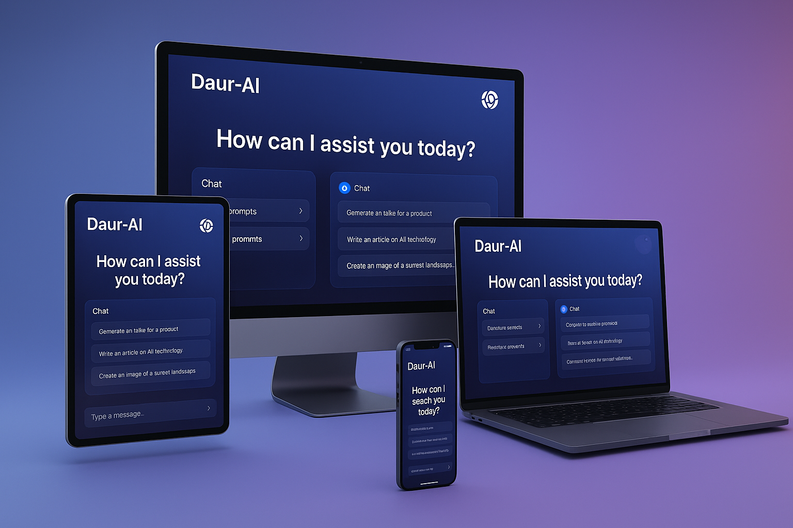
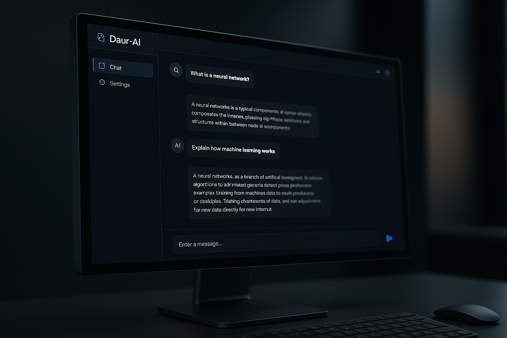
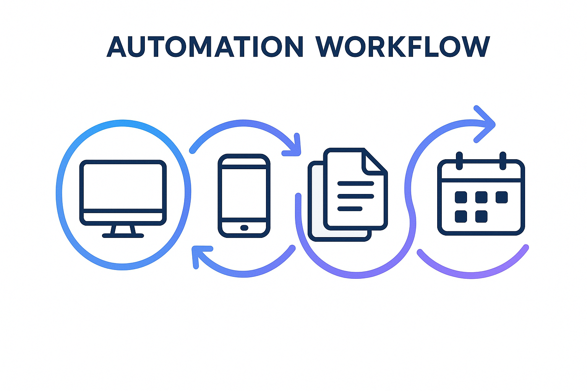
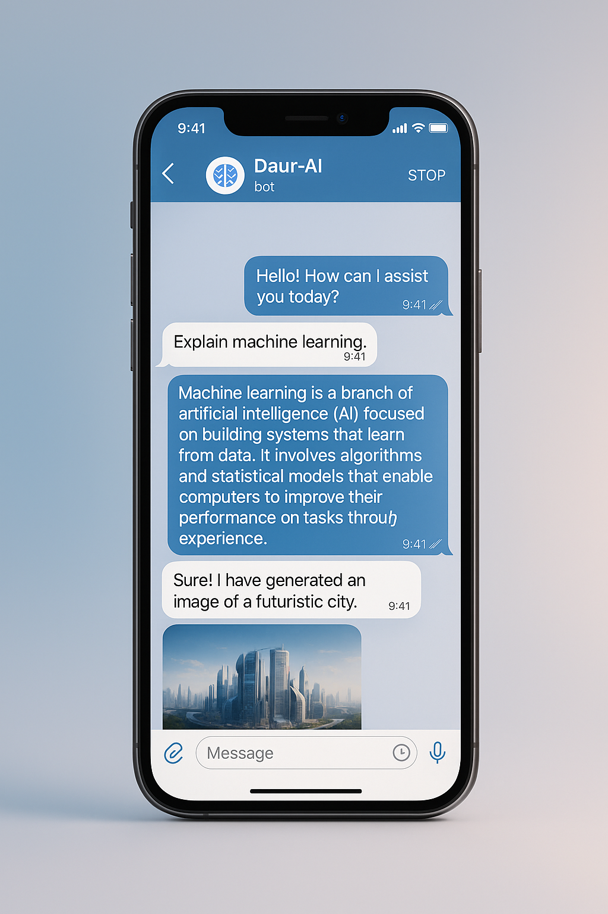
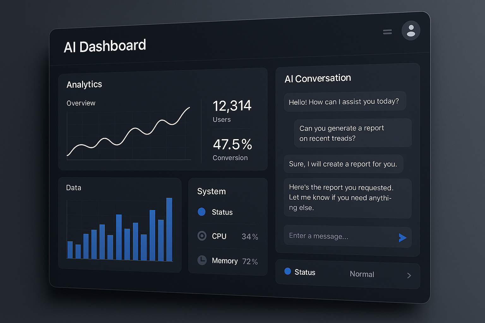

# 🤖 Daur-AI v2.0 - Revolutionary Autonomous AI Agent



[](https://opensource.org/licenses/MIT)
[](https://www.python.org/downloads/)
[](https://nodejs.org/)
[](https://electronjs.org/)
[](#)

**Daur-AI** is a revolutionary autonomous AI agent with computer vision, system control, and Telegram integration. It fully automates computer operations through natural language, providing a seamless and intuitive user experience.

## 🚀 Quick Start

### Installation

```bash
# Clone repository
git clone https://github.com/daurfinance/Daur-AI-v1.git
cd Daur-AI-v1

# Install dependencies
pip install -e .

# Or install specific requirements
pip install -r requirements.txt
```

### Running the Demo

```bash
# Test full system with safe_mode (safe for CI/testing)
python run_demo.py

# Run unit tests
pytest tests/test_input_controller_full.py -v

# Run integration tests
pytest tests/ -v
```

### Basic Usage

```python
from src.input.controller import InputController
import asyncio

async def example():
    # Create controller (safe_mode=True for testing, False for real input)
    controller = InputController(config={"safe_mode": False})
    
    # Mouse and keyboard automation
    await controller.click(100, 100)  # Click at coordinates
    await controller.move(200, 200)   # Move mouse
    await controller.type("Hello!")   # Type text
    await controller.hotkey("ctrl", "a")  # Hotkey combination
    
    # Clipboard operations
    await controller.clipboard_set("clipboard text")
    text = await controller.clipboard_get()
    
asyncio.run(example())
```

## ✨ Key Features

### 🧠 **Artificial Intelligence**


- **Multimodal AI Models:** Work with text, images, and audio for comprehensive understanding and interaction.
- **Autonomous Planning:** Break down complex tasks into manageable steps and execute them autonomously.
- **Self-Learning System:** Adapt to user behavior and improve efficiency over time.
- **Ollama and OpenAI Support:** Choose between local and cloud-based large language models for flexibility and privacy.

### 👁️ **Computer Vision**



- **Low-Level Screen Capture:** Bypass system protections to work with any application.
- **Real-Time OCR:** Read text from any interface, enabling automation of legacy systems.
- **Visual Navigation:** Find and click on UI elements based on visual cues.
- **Image Analysis:** Recognize objects and content within images for deeper understanding.

### 🎮 **System Control**



- **Full Mouse and Keyboard Control:** Automate any action you can perform manually.
- **Application Management:** Launch, stop, and switch between applications seamlessly.
- **File Operations:** Create, edit, and organize files and folders with simple commands.
- **System Monitoring:** Keep track of CPU, memory, and processes in real-time.

### 🌐 **Browser Automation**

- **Playwright Integration:** Automate modern web applications with a powerful and reliable framework.
- **Visual Recognition:** Interact with web elements that lack traditional selectors.
- **Form Filling:** Automatically populate and submit web forms.
- **Data Scraping:** Extract information from websites for analysis and reporting.

### 📱 **Telegram Integration**



- **Remote Control:** Manage your computer from anywhere using the Telegram messenger.
- **Voice Commands:** Issue commands and receive responses using your voice.
- **File Processing:** Analyze documents and images sent to the bot.
- **Real-Time Notifications:** Stay updated on the status of your tasks.

### 🖥️ **Modern Interfaces**



- **Electron Desktop Application:** Enjoy a native and feature-rich user experience.
- **React Web Panel:** Access a modern and responsive web interface from any device.
- **REST API:** Integrate Daur-AI with your existing systems and workflows.
- **Real-Time Monitoring:** Visualize system activity with charts and statistics.

## 🚀 Quick Start

### Automatic Installation

```bash
# Clone the repository
git clone https://github.com/daurfinance/Daur-AI-v1.git
cd Daur-AI-v1

# Run the automatic installation script
./install.sh

# Configure the Telegram bot (optional)
nano telegram_config.json  # Enter your TELEGRAM_BOT_TOKEN

# Start the system
./start_daur_ai.sh
```

## 🎯 Usage Examples

### Office Automation
```
"Create a presentation about quarterly sales."
"Email the report to all managers."
"Update the data in the Excel spreadsheet."
```

### Web Automation
```
"Find and download the latest news about Python."
"Fill out the registration form on this website."
"Compare the prices of this product on 5 online stores."
```

### System Administration
```
"Check disk usage and clear temporary files."
"Create a backup of important documents."
"Install system updates."
```

### Creative Tasks
```
"Create a logo for a startup."
"Generate music in the style of jazz."
"Write an article about machine learning."
```

## ⚙️ Configuration

### `telegram_config.json`
```json
{
    "telegram": {
        "bot_token": "YOUR_BOT_TOKEN",
        "allowed_users": [123456789],
        "features": {
            "voice_recognition": true,
            "file_processing": true,
            "image_analysis": true
        }
    },
    "ai_agent": {
        "auto_start": true,
        "default_model": "ollama",
        "fallback_model": "simple"
    },
    "web_interface": {
        "enabled": true,
        "port": 8000
    }
}
```

## 📦 Build and Distribution

### Create an Installer

```bash
# Build for all platforms
npm run build

# For the current OS only
npm run pack

# Create a portable version
npm run dist
```

## 🧑‍💻 Developer

This project is developed and maintained by **Dauirzhan Abdulmazhit**.

## 🆘 Support and Contact

- **Documentation:** [Wiki](https://github.com/daurfinance/Daur-AI-v1/wiki)
- **Issues:** [GitHub Issues](https://github.com/daurfinance/Daur-AI-v1/issues)
- **Discussions:** [GitHub Discussions](https://github.com/daurfinance/Daur-AI-v1/discussions)
- **Email:** daurfinance@gmail.com

## 📄 License

This project is licensed under the MIT License. See the [LICENSE](LICENSE) file for details.

---

<div align="center">

**🚀 The future of automation is here!**

[⭐ Star us on GitHub](https://github.com/daurfinance/Daur-AI-v1) | [🐛 Report a Bug](https://github.com/daurfinance/Daur-AI-v1/issues) | [💡 Suggest a Feature](https://github.com/daurfinance/Daur-AI-v1/discussions)

</div>

